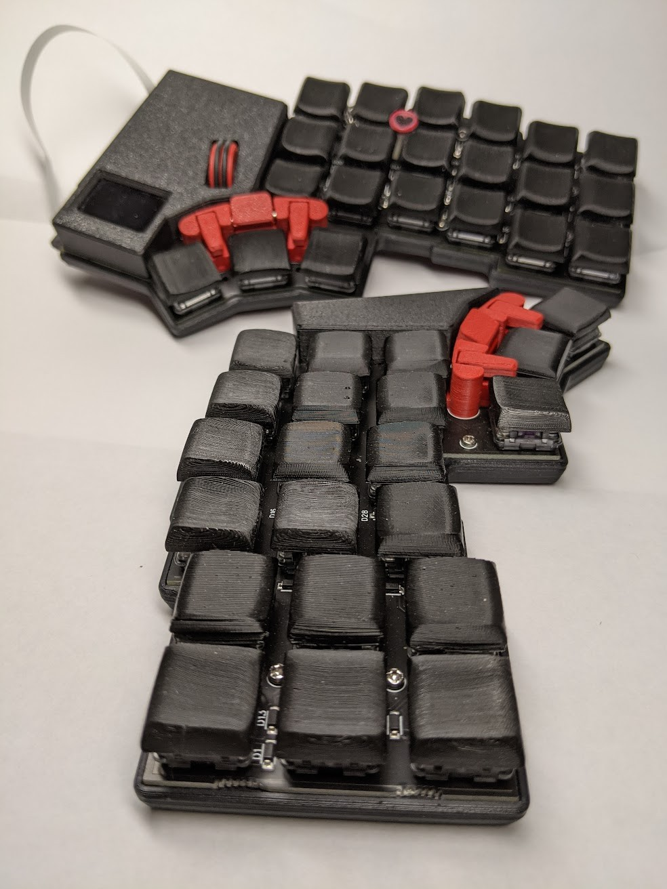
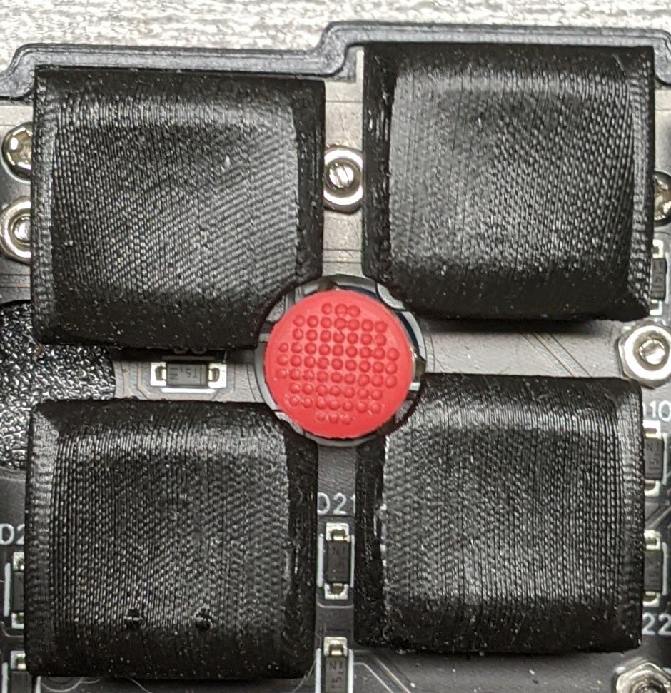

# Print Keycaps That Feel Great

This code modifies and positions open source, 3D printable key caps, such as Chicago Steno, for printing, using Lev Popov's suggestions for FDM printing keycaps in [the LPX repo](https://github.com/levpopov/LPX) and in [his printables for Chicago Steno](https://www.printables.com/model/158865-chicago-steno-low-profile-keycaps-kailh-choc).

## Modify Keycaps to Fit Around Trackpoint

This code also takes keycaps and cuts notches to make room for a trackpoint's rubber dome. No need to grind them down. It does this for the Santoku keyboard (pictured above), a tryadactyl with cylindrical placement, or ortholinear keyboards with MX or choc spacing. However, it can be easily modified to accommodate any keyboard layout.

### Placement
Two trackpoint placements are supported. The upper left corner of the home key, "index" or *index=true*, and the upper right corner of the home key, "middle" or *index=false*.

## Stupid Stem Tricks
For non-SCAD keycaps we can easily remove the stem using a `difference()` and replace it with whatever we like. This opens several possibilities. For SCAD keycaps we can likely tweak the source, or pass appropriate parameters.

### MX Stem Swap
The LPxMX profile is a choc keycap on an MX stem from @rsheldiii's [keyV2 library](https://github.com/rsheldiii/KeyV2.git) which was designed to be amenable to FDM printing.

### Stem Offsets
For dactyls using a typical cylindrical column placement, there is no issue with the keyswitches colliding. However, if we try to have a convex portion of our column (such as for the number row) the keycaps may be spaced far enough apart that the switches below would collide. Using an offset stem allows us to pack keycaps more tightly, while spacing the switches far enough apart that they don't intersect.

Currently only implemented for LPX.

# Profiles
### [LPX](https://github.com/levpopov/LPX)
No unmodified keycap is generated. Use [the source *.stl* file](https://github.com/levpopov/LPX/blob/main/LPX.stl).

Since LPX is a symmetrical, non-sculpted profile, right now only two trackpoint-modded keycaps are generated. Support for a homing key could be added.

### [Chicago Steno](https://github.com/pseudoku/PseudoMakeMeKeyCapProfiles)
A full set of keycaps can be rendered for printing.

For trackpoint use, an array of 4 keycaps is rendered (or optionally, files for individual keycaps), with the appropriate notches depending on *index* or *middle* placement. The keycaps are R3 homing, R3 and two R2s (near and far).

Chicago Steno from @pseudoku is made available under the GPL v3 and the optional (off by default) prerenders from @levpopov are CC BY-NC-SA 4.0.

# Usage
This repository relies on submodules to include keycaps where possible. Either clone it with the command `git clone --recurse-submodules --remote-submodules` to automatically fetch submodules, or run `git submodule update --init --recursive` in an already cloned repo before using.

Keycaps can be rendered using `make`. first edit `settings.scad` to set the keyboard, and optionally the grid spacing (only used by Chicago Steno for now). If run without arguments, `make` will render all profiles and positions for a given board. To save render time you can invoke a specific target such as `make lpx` or `make cs-middle`. A set of unmodified Chicago Steno keycaps can be generated with `make cs`. The targets `cs-middle-solo` and `cs-index-solo` generate modified keycaps in individual *.stl*s rather than arrays.

I strongly recommend downloading [a development snapshot of OpenSCAD](https://openscad.org/downloads.html#snapshots) and replacing the `OPENSCAD=openscad` line at the begining of the Makefile with the path to the downloaded build (don't forget to `chmod +x` it first, if using an AppImage), so that you can enable the `manifold` feature. I currently use `OPENSCAD=$(HOME)/downloads/OpenSCAD-2023.11.08.ai16933-x86_64.AppImage --enable=manifold --enable=predictible-output` (predictible-output will probably be slower, but it's useful for detecting changes).

# FDM Printing Suggestions
Parts are positioned with a 45 degree Y and Z rotation. These recommendations come from @levpopov. The Y rotation produces a smoother surface than printing flat. The Z rotation slows the print head and gets maximum cooling on the top surface.

If using a keycap array *.stl*, split the model to objects in your slicer, then enable *complete individual objects*.

The main issue I've had has been with the bottom edge of the keycap partially or full detaching during the print. The support tweaks are meant to address this issue, along with the model modifications to flatten the edges the keycap rests on while printing.

  - *layer height* - On the Prusa MK3S I used 0.1 mm. 0.07 mm is doable but arguably feels worse. 0.15 is acceptable and definitely where you should start your testing before trying to print multiple keycaps. On the Prusa MK4 I was able to use .05 mm with a brim which produced a very smooth top surface, but also a rough patch on one edge.
  - *0% infill* - This helps with surface smoothness. also faster.
  - *enable supports* - This thing is gonna tip over if you don't support it! I have preferred to use traditional supports. Tree supports are definitely not effective without a brim; the whole model benefits from a solid support structure. As of prusaslice 2.6, the default is support style is snug, which applies the following by default.
	- *Top contact Z distance* = 0.10 - get supports closer to the part
    - *Pattern spacing* = 1.5 - more supportive
  - *Complete individual objects* - prints parts one at a time so there isn't stringing between keycaps ruining the top surface. you also need to split models with multiple keycaps, if using.

# SLA Printing Suggestions
??? Someone with a resin printer please tell us.

# Suggestions Welcome!
Please open an issue to request support for new keycaps, new keyboards, flexibility in selecting row variants, etc. I'd like to expand this tool to accommodate as many uses as possible.

# TODO
  - [x] fix orientation of 'from source' CS keycaps
  - [x] check if LPX needs 2 different notches now that santoku offset is corrected
  - [ ] reorg related keycap code into directories
  - [ ] means to specify arbitrary arrays of keycaps (in settings/from render command)
    - [ ] split array generation off from main keycap files (can be generic? or per-profile?)
  - [x] means to generate individual trackpoint notched keycaps, not in an array
    - [ ] communicate trackpoint notch location in a more clear and universal manner
  - [ ] way to add sprues to keycap arrays for commercial 3D printing? what about shrinkage?
  - [ ] stem mods, such as integrated tilters
	- [x] LPxMX
    - [x] LPX-offset
    - [ ] CS-MX
    - [ ] longer LPX stem for damper?
  - [ ] try out more keycaps from https://github.com/namnlos-io/choc_keycaps
  - [ ] https://github.com/madebyperce/shelby-min-mx-keycaps LPxMX alternative?
  - [ ] support more keycaps from keyV2? rewrite this code a branch of keyV2?
  - [ ] CS T1S
  - [ ] bigger homing dots?
  - [ ] makefile rules to fetch submodules if missing
